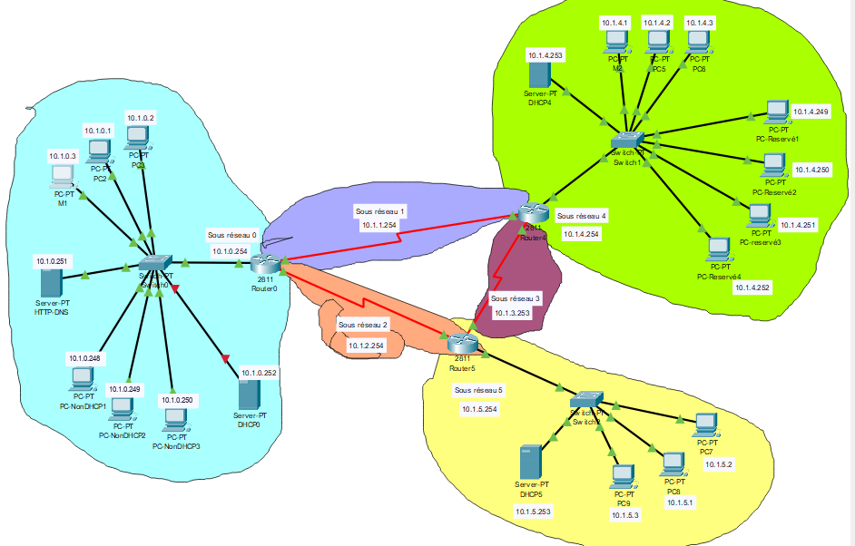
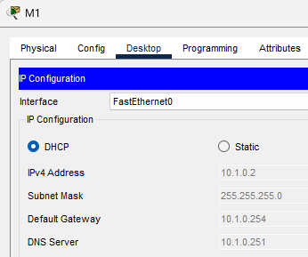
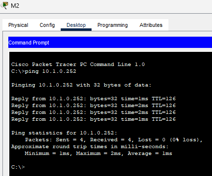
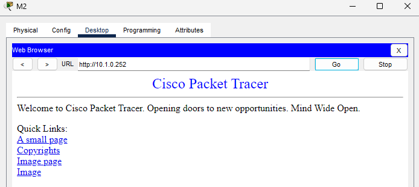
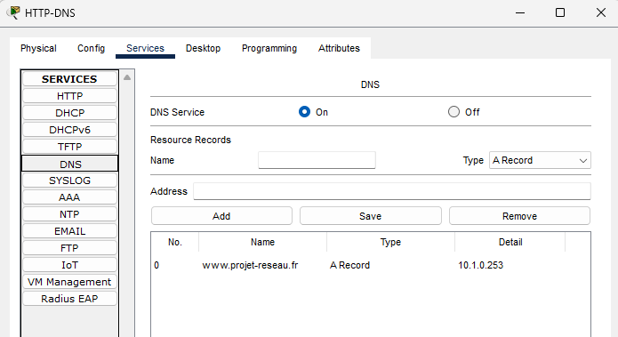

# Réseau multi-sites avec DHCP redondant — Cisco Packet Tracer

Réseau simulé sous Cisco Packet Tracer : trois sites reliés par des liaisons série, un routage dynamique RIP, un service DHCP qui continue de fonctionner si un serveur tombe, et un serveur DNS + web accessible depuis tous les sites.

Réalisé dans le cadre d'une SAE réseau du BUT Informatique.



## En bref

| | |
|---|---|
| **Routeurs** | 3 × Cisco 2811 (R0, R4, R5), reliés en triangle par des liaisons série |
| **Routage** | RIP sur 10.0.0.0 : chaque routeur apprend seul les réseaux des autres |
| **Sites** | 3 réseaux locaux, 16 postes au total, un switch par site |
| **DHCP** | 1 serveur par site, chacun capable de prendre le relais pour les deux autres |
| **DNS + web** | `www.projet-reseau.fr` résolu et servi par le serveur 10.1.0.251 |

Fichier à ouvrir : [`reseau.pkt`](reseau.pkt) (Packet Tracer 8.2 ou plus récent). Les configurations des routeurs sont aussi lisibles sans Packet Tracer, dans [`docs/configs/`](docs/configs/).

## Plan d'adressage

Tous les sous-réseaux sont des /24 découpés dans 10.1.0.0/16.

| Sous-réseau | Adresse | Rôle | Interfaces |
|---|---|---|---|
| 0 | 10.1.0.0/24 | LAN du site R0 | R0 Fa0/0 = .254 |
| 1 | 10.1.1.0/24 | Liaison série R0 ↔ R4 | R0 S0/3/0 = .254, R4 S0/3/0 = .253 |
| 2 | 10.1.2.0/24 | Liaison série R0 ↔ R5 | R0 S0/3/1 = .254, R5 S0/3/1 = .253 |
| 3 | 10.1.3.0/24 | Liaison série R4 ↔ R5 | R4 S0/3/1 = .254, R5 S0/3/0 = .253 |
| 4 | 10.1.4.0/24 | LAN du site R4 | R4 E1/0 = .254 |
| 5 | 10.1.5.0/24 | LAN du site R5 | R5 E1/0 = .254 |

Le triangle de liaisons série donne deux chemins entre chaque paire de sites : si une liaison tombe, RIP fait passer le trafic par le troisième routeur.

### Répartition des adresses dans chaque LAN

| Plage | LAN 0 | LAN 4 | LAN 5 |
|---|---|---|---|
| DHCP principal (serveur du site) | .1 – .173 | .1 – .177 | .1 – .173 |
| DHCP de secours n° 1 | .174 – .209 (DHCP5) | .178 – .215 (DHCP5) | .174 – .209 (DHCP0) |
| DHCP de secours n° 2 | .211 – .246 (DHCP4) | .216 – .248 (DHCP0) | .211 – .246 (DHCP4) |
| Postes à adresse fixe | .248 – .250 | .249 – .252 | — |
| Serveurs | .251 DNS + web, .252 DHCP0 | .253 DHCP4 | .253 DHCP5 |
| Passerelle (routeur) | .254 | .254 | .254 |

## DHCP redondant

Un client DHCP envoie sa demande en broadcast, et un broadcast ne traverse pas un routeur. Deux mécanismes sont combinés :

1. **Relais DHCP** : sur l'interface LAN de chaque routeur, deux `ip helper-address` transmettent les demandes aux serveurs DHCP des deux **autres** sites. Le serveur local, lui, reçoit directement le broadcast.
   ```
   interface Ethernet1/0            ! R4, côté LAN 4
    ip address 10.1.4.254 255.255.255.0
    ip helper-address 10.1.0.252    ! DHCP0
    ip helper-address 10.1.5.253    ! DHCP5
   ```
2. **Pools de secours** : chaque serveur a son pool principal, plus un petit pool pour chacun des deux autres LAN. Les plages ne se chevauchent jamais, donc deux serveurs ne peuvent pas attribuer la même adresse.

Résultat : chaque demande arrive aux trois serveurs, et le client garde la première offre reçue (en pratique celle du serveur local). Si le serveur d'un site est en panne, les postes obtiennent quand même une adresse d'un autre site, avec la bonne passerelle et le bon DNS.

Les postes à adresse fixe sont placés hors de toutes les plages DHCP, pour qu'aucun serveur ne puisse distribuer leur adresse à un autre poste.

## Tests

| Test | Commande (depuis un PC) | Résultat attendu |
|---|---|---|
| Routage entre sites | `ping 10.1.0.251` depuis M2 (LAN 4) | réponses avec TTL=126, soit 2 routeurs traversés |
| Attribution DHCP | `ipconfig /renew` sur M1 | adresse dans .1 – .173, passerelle 10.1.0.254, DNS 10.1.0.251 |
| DHCP de secours | éteindre DHCP0, puis `ipconfig /renew` sur M1 | adresse dans une plage de secours (.174 – .209 ou .211 – .246) |
| Résolution DNS | `nslookup www.projet-reseau.fr` | 10.1.0.251 |
| Web | navigateur du PC : `http://www.projet-reseau.fr` | page du projet |
| Poste fixe | `ping 10.1.5.254` depuis PC-NonDHCP1 | réponses |
| Chemin de secours | couper la liaison R0 ↔ R4, puis `tracert 10.1.4.254` depuis le LAN 0 | le trafic passe par R5 |

## Captures

**Attribution DHCP** : M1 reçoit automatiquement son adresse, sa passerelle (10.1.0.254) et son serveur DNS (10.1.0.251).



**Routage entre sites** : ping depuis M2 (LAN 4) vers un serveur du LAN 0. TTL=126 : le paquet a traversé 2 routeurs.



**Navigateur web** de M2 vers un serveur du LAN 0.



**Service DNS** : enregistrement A de `www.projet-reseau.fr`. Capture prise avant les corrections, quand l'enregistrement pointait encore vers 10.1.0.253 (voir plus bas).



## Corrections apportées à la version finale

Une relecture complète de la configuration a mis en évidence plusieurs erreurs, corrigées dans `reseau.pkt` :

- **Passerelle des postes fixes** : les 7 postes configurés à la main avaient pour passerelle 10.1.1.200, une adresse de la liaison série. Ils ne pouvaient donc joindre que leur propre LAN. Ils utilisent maintenant le routeur de leur site (10.1.0.254 ou 10.1.4.254).
- **DNS des postes fixes** : ils pointaient vers 10.1.0.253, une adresse qui n'appartient à aucun équipement. Ils utilisent maintenant 10.1.0.251, comme les postes en DHCP.
- **Conflits d'adresses** : les postes fixes du LAN 0 (.51 à .53) étaient dans la plage DHCP principale, et un pool de secours du LAN 4 allait jusqu'à .251, sur les postes réservés. Les postes fixes du LAN 0 sont passés en .248 – .250 et le pool de secours s'arrête à .248.
- **Un seul serveur DNS** : le serveur DHCP0 avait aussi un DNS actif avec un ancien enregistrement faux. Il est désactivé.
- **Un rôle par serveur** : le service web par défaut est coupé sur les serveurs DHCP, et la page du serveur web confirme qu'on est sur `www.projet-reseau.fr`.
- **Routeurs** : noms d'hôte explicites (Router0, Router4, Router5 au lieu de « Router » partout) et configuration sauvegardée en mémoire de démarrage (`copy running-config startup-config`).

## Pistes d'amélioration

- Passer en **RIP version 2** (`version 2`, `no auto-summary`) pour transporter les masques. C'est indispensable dès que les sous-réseaux n'ont plus tous la même taille, par exemple des /30 sur les liaisons série au lieu de /24.
- Découper chaque LAN en **VLAN** (postes, serveurs, administration) avec un routage inter-VLAN.
- Ajouter des **ACL** pour limiter l'accès aux serveurs.
- Protéger les accès aux routeurs : mot de passe `enable secret`, SSH au lieu de Telnet sur les lignes vty.

## Auteur

Tanim Veer, étudiant en BUT Informatique (parcours Data & IA)

[GitHub](https://github.com/tanim-veer) · [Portfolio](https://tanim-veer.fr)
